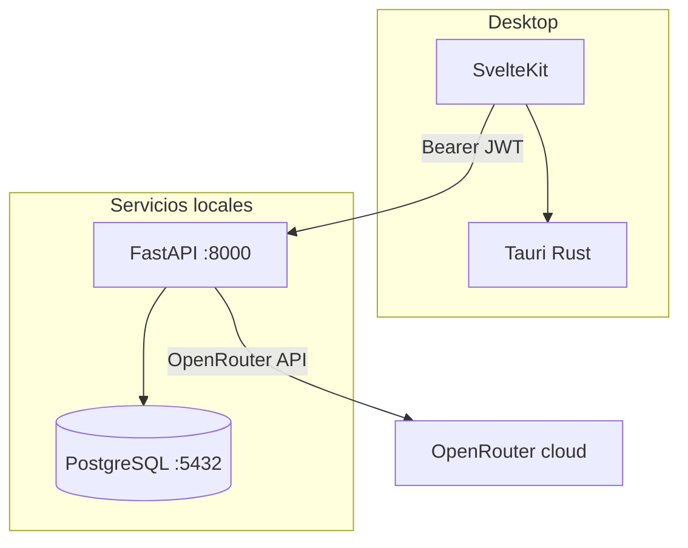

# Arquitectura

## Visión general

Classtify es una aplicación **local**: una instalación por escuela/máquina. El desktop (Tauri) se comunica con el backend FastAPI en `localhost:8000` usando JWT bearer.



## Responsabilidades por capa

| Capa | Responsabilidad |
|------|-----------------|
| **SvelteKit** | UI, navegación, llamadas HTTP, estado de pantalla |
| **Tauri / Rust** | Integración OS: archivos nativos, URLs externas, notificaciones |
| **FastAPI** | Auth, lógica de negocio, OR-Tools, OpenRouter, Google Sheets |
| **PostgreSQL** | Usuarios + datos de negocio |

**Regla:** no duplicar lógica de negocio en Rust.

## Flujo de desarrollo

```
Terminal 1:  pnpm dev:db
Terminal 2:  pnpm dev:backend
Terminal 3:  pnpm dev
```

## Carpetas clave

- `src/lib/components/ui/` — primitivos UI reutilizables
- `src/lib/api/` — cliente HTTP al backend
- `backend/app/auth/` — FastAPI Users + JWT
- `backend/app/ai/` — cliente OpenRouter
- `backend/app/api/v1/` — endpoints versionados
